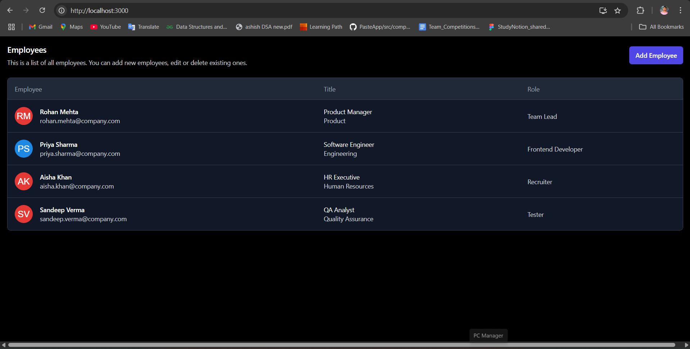
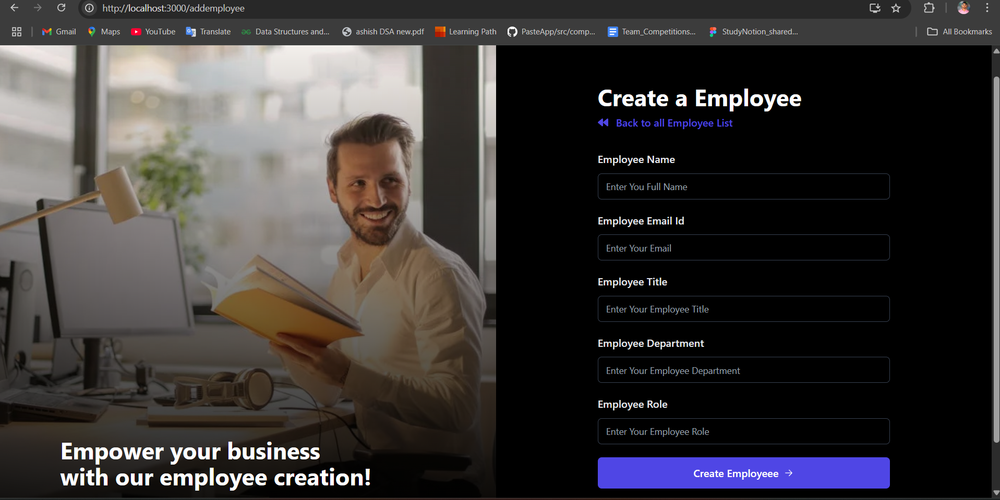
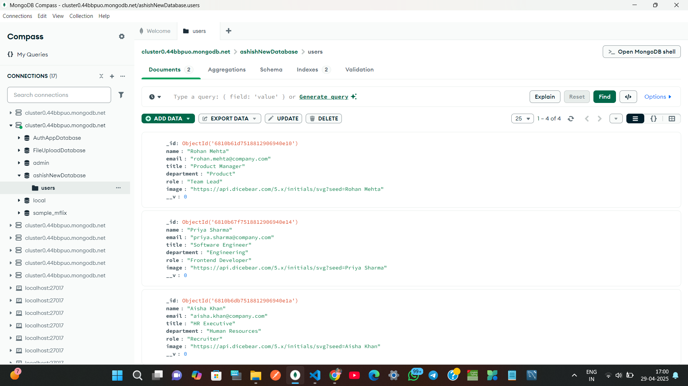

# EmployeeManager

EmployeeManager is a full-stack MERN application for managing employee records.

## Features
- Add, edit, and delete employee data 
- Responsive UI with React
- Backend powered by Node.js, Express.js, and MongoDB

## Demo Screenshots

### 🧾 Employee List Page


### ➕ Add Employee Page


### 🗄️ MongoDB Database View



## Tech Stack
- MongoDB
- Express.js
- React
- Node.js

## How to Run Locally

### Backend
```bash
cd backend
npm install
npm dev

// For Frontend
cd frontend
npm install
npm start
